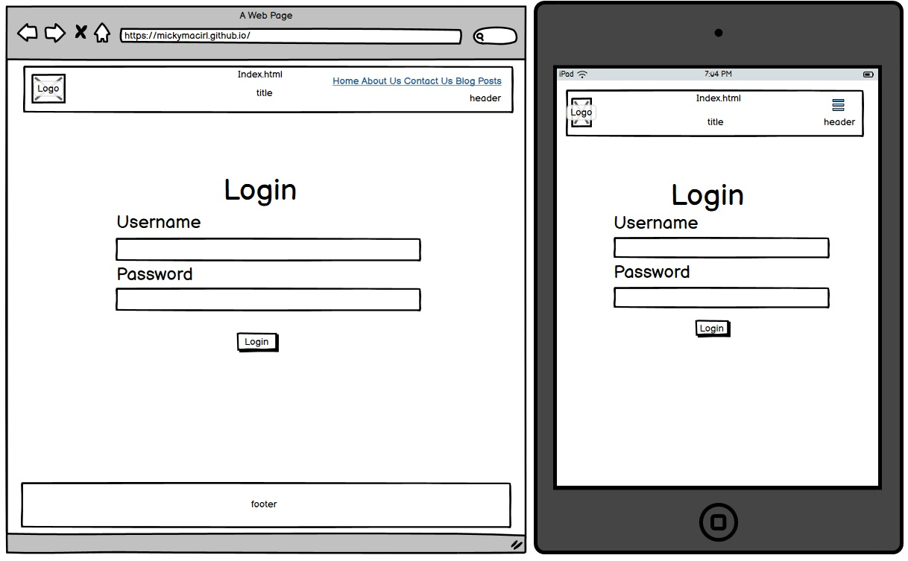

# Irish Cyber Security Blog

Irish Cyber Security Blog is a **blog** to *store information* about **irish cyber security topics**, *share thoughts and insights with others in the community and stay up to date with the latest threats and solutions*.
It allows users to **read**, **comment on** and **bookmark** posts posted by the administrators of the blog.

The Irish Cyber Security Blog can be found *[here](https://icsblogp4.herokuapp.com/)*.

## User Experience Design (UX)

## The Strategy Plane

## Site Goals

 The goal of this Irish cyber security blog is to provide readers in Ireland with accurate and up-to-date information about cyber security, educate the Irish public on how to stay safe online and protect themselves from cyber threats, assist Irish businesses and organizations in improving their cyber security practices and defending themselves against cyber-attacks, act as a resource for Irish cyber security professionals by bringing them up to date on the latest research and news in the field, and raise awareness of cyber security issues in Ireland to encourage more people to become interested in this critical topic.

## Agile Planning

The project was developed using agile practices, with small features delivered in incremental sprints over a two-week period. Issues were organized into milestones and prioritized using labels such as "must have," "should have," "could have," and "nice to have."

These milestones were divided into sprints based on six milestones, with "must have" stories being completed first, followed by "should have" stories, and finally "could have" and "nice to have" stories. This prioritization ensured that all essential requirements were completed first, providing a solid foundation for the application and allowing for the addition of must-have features.

GitHub Projects was used to create a Kanban board, which can be found [here](https://github.com/users/mickymacirl/projects/2/views/1?layout=table&visibleFields=%5B%22Title%22%2C%22Assignees%22%2C%22Status%22%2C%22Milestone%22%2C%22Labels%22%5D). Each story, such as the documentation milestones, is an issue. Each story contains a description of the relevant acceptance criteria that must be fulfilled. There is a "won't do" option for any features that are not implemented.

## Milestones

This project has 6 main Milestones:

 1. Basic Setup

    > The basic setup milestone contains all of the stories needed for the blog's initial setup.
    The blog wouldn't be feasible without the basic setup, so it was the initial milestone to
    be produced since all other functionalities are dependent on the successful completion
    of the basic setup.

 2. Stand Alone Pages Setup

    > The standalone pages milestone is for comparatively tiny pages with insufficient stories
    to justify a full milestone. Rather than generating milestones for minimal features like
    error pages, these minimal features were categorized under this milestone.

 3. Authentication Setup

    >The authentication milestone includes all stories concerning registration, login, and
    authentication. This milestone is critical and important because otherwise, the blog's
    administrators would be unable to manage posts or comments securely without normal users
    having the ability to see and execute administrator commands.

 4. Admin Setup

    >The milestone admin setup includes all stories concerning creating, viewing, updating, and
    deleting posts, in addition to managing comments, users, and categories. This makes it
    simple for administrators to view posts, manage posts, manage comments on these posts,
    and manage administrator users and categories.

 5. User Views

    > The milestone users' views feature allows a blog user to leave a comment on a post,
    filter categories, and bookmark a post. This milestone is critical and essential for
    a user in order to create a comment, filter, and categorize posts.

 6. Documentation

    > This milestone includes all document-related stories and tasks required to
    document the software development process for the application. It aspires to
    provide high-quality documentation that aids in the understanding of all stages of
    development in addition to the information required for running, deploying,
    and operating the application.

## User Stories

During the four sprints, the following user stories were completed (in order of milestone).

### Milestone 1 - Basic Setup

---

#### 1.1 As a developer, I must set up the project so that it can implement the core features

   >*[Issue 2 GitHub Project](https://github.com/mickymacirl/CI-P4-ICSB/issues/2)* for information.

#### 1.2 As a developer, I must set up static files and folders so that the project images, CSS and javascript work on the website

   >*[Issue 12 GitHub Project](https://github.com/mickymacirl/CI-P4-ICSB/issues/12)* for information.

#### 1.3 As a developer, I must create the basic base.html page and project structure so the layout is uniform

   >*[Issue 13 GitHub Project](https://github.com/mickymacirl/CI-P4-ICSB/issues/13)* for information.

#### 1.4 As a developer, I must create a footer with social media links and contact information

   >*[Issue 3 GitHub Project](https://github.com/mickymacirl/CI-P4-ICSB/issues/3)* for information.

#### 1.5 As a developer, I need to create the main website header with logo and web page links

   >*[Issue 4 GitHub Project](https://github.com/mickymacirl/CI-P4-ICSB/issues/4)* for information.

#### 1.6 As a developer, I must create a navigation bar that works on any device

   >*[Issue 8 GitHub Project](https://github.com/mickymacirl/CI-P4-ICSB/issues/8)* for information.

#### 1.7 As a Cybersecurity professional, I want to be able to view Irish Cyber Security Blog so that I can stay up-to-date on the latest threats and solutions

   >*[Issue 9 GitHub Project](https://github.com/mickymacirl/CI-P4-ICSB/issues/9)* for information.

### Milestone 2 - Stand Alone Pages Setup

---

#### 2.1 As a developer, I must implement a 404-error page to alert users when they try to access a page that doesn't exist

   >*[Issue 5 GitHub Project](https://github.com/mickymacirl/CI-P4-ICSB/issues/5)* for information.

#### 2.2 As a developer, I need to create a 500-error page to alert website users when the application generates an internal server error

   >*[Issue 7 GitHub Project](https://github.com/mickymacirl/CI-P4-ICSB/issues/7)* for information.

#### 2.3 As a developer, I must implement a 403-error page to alert users when they do not the right to access this page

   >*[Issue 24 GitHub Project](https://github.com/mickymacirl/CI-P4-ICSB/issues/24)* for information.

#### 2.4 As a Cybersecurity professional, I want to be able to contact the Irish Cyber Security Blog so that I can express my option on a post

   >*[Issue 22 GitHub Project](https://github.com/mickymacirl/CI-P4-ICSB/issues/22)* for information.

#### 2.5 As a Cybersecurity professional, I want to be able to find out information about the site owners of the Irish Cyber Security Blog so that I am kept informed

   >*[Issue 23 GitHub Project](https://github.com/mickymacirl/CI-P4-ICSB/issues/23)* for information.

### Milestone 3 – Authentication Setup

---

#### 3.1 As a developer, I must set up AllAuth so that website users can sign up and access the features

   >*[Issue 6 GitHub Project](https://github.com/mickymacirl/CI-P4-ICSB/issues/6)* for information.

#### 3.2 As a Cybersecurity professional, I want to be able to register to Irish Cyber Security News so that I can stay up-to-date on the latest news and events in the industry

   >*[Issue 14 GitHub Project](https://github.com/mickymacirl/CI-P4-ICSB/issues/14)* for information.

### Milestone 4 – Admin Setup

---

#### 4.1 As an admin, I need to be able to administer Posts

   >*[Issue 17 GitHub Project](https://github.com/mickymacirl/CI-P4-ICSB/issues/17)* for information.

#### 4.2 As an admin, I need to be able to administer comments

   >*[Issue 16 GitHub Project](https://github.com/mickymacirl/CI-P4-ICSB/issues/16)* for information.

#### 4.3 As an admin, I need to be able to administer users

   >*[Issue 18 GitHub Project](https://github.com/mickymacirl/CI-P4-ICSB/issues/18)* for information.

#### 4.4 As an admin, I need to be able to administer categories

   >*[Issue 19 GitHub Project](https://github.com/mickymacirl/CI-P4-ICSB/issues/19)* for information.

### Milestone 5 – User Views

---

#### 5.1 As a Cybersecurity professional, I want to be able to comment on posts on Irish Cyber Security Blog so that I can share my thoughts and insights with others in the community

   >*[Issue 15 GitHub Project](https://github.com/mickymacirl/CI-P4-ICSB/issues/15)* for information.

#### 5.2 As a Cybersecurity professional, I want to be able to filter Irish Cyber Security Blog posts by category (e.g., Threats, Solutions, Industry) so that I can focus on the topics that are most relevant to me

   >*[Issue 20 GitHub Project](https://github.com/mickymacirl/CI-P4-ICSB/issues/20)* for information.

#### 5.3 As a Cybersecurity professional, I want to save Irish Cyber Security News articles for later reading so that I can revisit them when I have more time

   >*[Issue 21 GitHub Project](https://github.com/mickymacirl/CI-P4-ICSB/issues/21)* for information.

### Milestone 6 - Documentation

---

#### 6.1 Complete all Documentation

   > Readme: [https://github.com/mickymacirl/CI-P4-ICSB/issues/10](https://github.com/mickymacirl/CI-P4-ICSB/issues/10)
Testing Readme: [https://github.com/mickymacirl/CI-P4-ICSB/issues/11](https://github.com/mickymacirl/CI-P4-ICSB/issues/11)

## The Scope Plane

* Mobile designed responsive blog
* Admin section for website owner
* Enable the administer of all functions for the post and comment sections
* Multi-layered security approval administration for posts and comments
* Main page for users to view posts

## The Structure Plane

## Features

### User Story - As a developer, I must set up the project so that it can implement the core features

This user story focuses on setting up the necessary infrastructure for the project. It specifies that the developer must ensure that the project is appropriately set up and the environment and deployment configured to implement the core features essential to its function. This story involves setting up the necessary databases and other components, like the settings.py file needed to support the project and configuring the project's codebase and dependencies. By ensuring that the project is working correctly, we can deliver the critical functionality that users expect and are comfortable using.

Implementation of Core Features

* [X] Django - Install and configure Django and any dependencies.

* [X] Project created - Create Django project and configure any settings.

* [X] Environment setup - Setup environment for the project blog.

* [X] Settings.py file - Setup settings.py file to reduce sensitive information leaking.

* [X] Deploy to Heroku - Deploy base project to heroku.

Completed.

### User Story - As a developer, I must set up static files and folders so that the project images, CSS and JavaScript work on the website

The goal of this user story is to properly set up static files and folders within the project so that the images, CSS and JavaScript will be displayed and function correctly on the website. This user story is essential for ensuring users' cohesive and visually appealing website experience.

Implementation of Static Files

* [X] Static folders and settings setup - Create static folders and setup the correct settings.

* [X] Subfolders created for images, CSS, and JavaScript - Create and setup folders for the likes of images, CSS, and JavaScript

Completed but with errors, see bugs.

### User Story - As a developer, I need to create the main website header with logo and web page links

The main website header is the top portion of the website that typically includes the logo and links to other pages on the site. This user story involves setting up the header to be functional and correctly displaying the logo and page links.

Implementation of Header

* [X] Header created - Create header for website.

* [X] Links created - Create links for the header of the website.

* [X] Logo setup - Create logo and configure logo in header of the website.

### User Story - As a developer, I must create a footer with social media links and contact information

As a developer, I must create a footer for the website with links to the blog's social media pages and contact information, such as an email address or phone number, for users to easily access and contact the blog owners.

Implementation of Footer

* [X] Footer created - Create footer for blog.

* [X] Social media links - Create social media links.

* [X] Social media links open in a new tab - Ensure social media links open in new tab.

* [X] Social media links connect to the correct website URLs - Ensure social media links connect to the correct website URLs.

* [X] Contact information is correct - Ensure contact information is correct

### User Story - As a developer, I must create a navigation bar that works on any device

The navigation bar is a vital element of any website, allowing users to find and access different site pages easily. This user story specifies that the navigation bar will be designed to be responsive, meaning that it should work correctly on any device, whether a desktop computer, a tablet or a smartphone. This user story is important because it ensures users can access and navigate the site easily, regardless of their device.

Implementation of Navigation Bar

* [X] Home - All users can see - The Home page is visible to all users.

* [X] About Us - All users can see - The About Us page is visible to all users.

* [X] Contact Us - All users can see - The Contact Us page is visible to all users.

* [X] Blog Posts - All users can see - The Blog Posts page is visible to all users.

* [X] Register - Only logged-out users can see - The Register page is only visible to users who are not logged in.

* [X] Login - All users can see - The Login page is visible to all users.

* [X] Logout - Only logged-in users can see - The Logout page is only visible to users who are logged in.

### User Story - As a Cybersecurity professional, I want to be able to view Irish Cyber Security Blog so that I can stay up-to-date on the latest threats and solutions

The user wants to be able to view the Irish Cyber Security Blog in order to stay informed about the latest threats and solutions in the field of cybersecurity.

Implementation of Home Page

* [X] The home page is created with the theme of the website layout - Create home page to view main blog.

### User Story - As a developer, I must create the basic base.html page and project structure so the layout is uniform

This user story is about creating the base HTML page and the overall project structure to ensure that the website layout is consistent. The base.html page will serve as a template for other pages on the website, allowing for easy modification of the form and design. The project structure will also be set up to ensure that all necessary files and folders are organized in an easily accessible manner.

Implementation of Base.html

* [X] Base.html page created with the uniform layout - Create Base.html file and all settings and requirements.

* [X] Navigation menu is correct - Ensure the navigation menu is correct.

* [X] The footer information  is correct - Ensure The footer information is correct.

### User Story - As a developer, I must implement a 404 error page to alert users when they try to access a page that doesn't exist

The 404 error page will be displayed when a user tries to access a page that does not exist on the website. This page will alert the user that the page they are trying to access does not exist and provide them with options to navigate to other pages on the website.

Implementation of 404 Error Page

* [X] 404 error page is created - Create 404 error page.

* [X] Error information is expanded upon - Ensure message is explained and navigation to other pages.

404 Error Page Image

### User Story - As a developer, I need to create a 500 error page to alert website users when the application generates an internal server error

The 500 error page will be displayed to website users when an application issue generates an internal server error. This page will alert the user that there has been an issue and provide a way for them to contact the website team to report the problem.

Implementation of 500 Error Page

* [X] 500 error page is created - Create 500 error page.

* [X] Error information is expanded upon - Ensure message is explained and option to report to blog admins.

### User Story - As a developer, I must implement a 403 error page to alert users when they do not the right to access this page

The developer must create a 403 error page that will be displayed to users when they attempt to access a page or resource they do not have permission to view. This page will alert the user that they do not have the necessary rights to access the requested content and provides instructions on requesting permission or access. This feature is essential for maintaining security and protecting sensitive information on the website.

Implementation of 403 Error Page

* [X] 403 error page is created - Create 403 error page.

* [X] Error information is expanded upon - Ensure message is explained and an option to request access to the page or feature.

403 Error Page Image

### User Story - As a Cybersecurity professional, I want to be able to contact the Irish Cyber Security Blog so that I can express my option on a post

A user wants to be able to contact the Irish Cyber Security Blog to express their opinion on a specific post.

Implementation of Contact Us Page

* [X] Contact Us page so users can contact the site owners - Create Contact Us page.

### User Story - As a Cybersecurity professional, I want to be able to find out information about the site owners of the Irish Cyber Security Blog so that I am kept informed

As a Cybersecurity professional, I want to be able to find information about the site owners of the Irish Cyber Security Blog so that I am informed about who is responsible for the content on the site.

Implementation of About Us Page

* [X] About Us page so users can find information about the site owners - Create About Us page.

### User Story - As a developer, I must set up AllAuth so that website users can sign up and access the features

As a developer, I must set up AllAuth so that website users can create an account and log in to the website to access certain features. This user story will allow users to register and manage their accounts and access restricted content on the site.

Implementation of AllAuth

* [X] AllAuth plugin installed and configured - Install AllAuth and configure.

* [X] Users can sign up and log in - Ensure users can sign up and log in.

* [X] Customize AllAuth templates to the site theme - Ensure AllAuth templates have the sites theme.

Completed.

### User Story - As a Cybersecurity professional, I want to be able to register to Irish Cyber Security News so that I can stay up-to-date on the latest news and events in the industry

This user story involves creating a registration feature on the Irish Cyber Security News website that allows Cybersecurity professionals to sign up and receive updates on the latest news and events in the industry. This feature will enable users to stay informed about developments in the field and keep track of relevant events.

Implementation of Registration

* [X] User can register - Create user register.

* [X] Test functionality - Test that users can register for the blog.

### User Story - As an admin, I need to be able to administer Posts

As an administrator, I need to be able to manage posts on the Irish Cyber Security Blog, including creating, filtering, editing, publishing, deleting, setting the status of posts, and setting a post as pinned. This user story will allow an admin to effectively manage the content on the blog and ensure that it is up-to-date and relevant to the community.

Implementation of Posts

* [X] Admin can create a post:

   > The admin can create a new post by filling out the necessary fields (title, content, etc.) and submitting the form.

* [X] Admin can filter by Status, Author, Created On, Category and Pinned:

   > The admin can filter the list of posts by various criteria, including status (published, draft, disabled), author, creation date, category, and pinned status.

* [X] Admin can edit a post:

   > The admin can edit an existing post by making changes to its fields and saving the changes.

* [X] Admin can set a post to Published:

   > The admin can set a post to the "published" status, making it visible to users on the website.

* [X] Admin can delete a post:

   > The admin can delete a post from the website permanently.

* [X] Admin can set a post to Draft:

   > The admin can set a post to the "draft" status, which means it is not yet ready to be published but can be worked on further.

* [X] Admin can set a post to Disabled:

   > The admin can set a post to the "disabled" status, which means it is not visible to users on the website.

* [X] Admin can set a post as is_pinned:

   > The admin can set a post to be "pinned", which means it will be displayed at the top of the list of posts on the website.

Post Image

### User Story - As an admin, I need to be able to administer comments

As an admin, I can manage comments on the Irish Cyber Security Blog, including editing, approving, and deleting comments and filtering them by different criteria, such as their status, creation date, and associated post. I can also set the status of a comment to review, accepted, or spam and activate or deactivate a comment. This user story will allow an admin to ensure that all comments on the blog are appropriate and align with the community guidelines.

Implementation of Comments

* [X] Admin can edit a comment:

   > The admin can make changes to the content of a comment.

* [X] Admin can approve a comment:

   > The admin can mark a comment as approved for publication.

* [X] Admin can delete a comment:

   > The admin can remove a comment from the website.

* [X] Admin can filter by Active, Created On, Name, Post or Status:

   > The admin can search for comments based on various criteria such as whether they are active, the date they were created, the name of the person who made the comment, the post they are associated with, or their current status (e.g., review, accepted, spam).

* [X] Admin can set Status to Review, Accepted or Spam:

   > The admin can change the status of a comment to either "review," "accepted," or "spam".

* [X] Admin can set comment to Active:

   > The admin can mark a comment as active, making it visible on the website.

Comment Image

### User Story - As an admin, I need to be able to administer users

As an admin, I can manage the users on the site, including editing user information, resetting passwords, creating new users, granting superuser status, setting user permissions, and setting admin permissions. This user story will allow an admin to manage the user accounts on the site and ensure that users have the appropriate access and permissions.

Implementation of Users

* [X] Admin can edit users:

   > The admin can edit user details such as name, email, and password.

* [X] Admin can edit user password:

   > The admin Admin can reset a user's password if they have forgotten their login credentials.

* [X] Admin can create users:

   > The admin can create new users for the website.

* [X] Admin can set superuser status:

   > The admin can set a user as a superuser, which gives them access to all features of the website.

* [X] Admin can set user permissions:

   > The admin can set specific permissions for a user, such as the ability to create or edit content on the website.

* [X] Admin can set admin permissions:

   > The admin can set permissions for themselves as an administrator, such as the ability to edit user details or delete content from the website.

Users Image

### User Story - As an admin, I need to be able to administer categories

The admin can manage categories by editing, deleting, or adding new categories. This user story allows them to keep the categories up-to-date and relevant to the Irish Cyber Security Blog content.

Implementation of Categories

* [X] Admin can edit categories:

   > The admin can modify the name of a category.

* [X] Admin can delete categories:

   > The admin can remove a category from the list of available categories.

* [X] Admin can add categories:

   > The admin can create a new category which adds it to the list of available categories.

Categories Image

### User Story - As a Cybersecurity professional, I want to be able to comment on posts on Irish Cyber Security Blog so that I can share my thoughts and insights with others in the community

A user can comment on a post on the Irish Cyber Security Blog. This user story allows them to share their thoughts and insights with other community members and engage in discussions about the post's topic.

Implementation of User Comments

* [X] Users can comment on posts - Users can leave their thoughts and insights on posts on the Irish Cyber Security Blog.

User Comments Image

### User Story - As a Cybersecurity professional, I want to be able to filter Irish Cyber Security Blog posts by category (e.g., Threats, Solutions, Industry) so that I can focus on the topics that are most relevant to me

A user should be able to filter the blog posts by specific categories to narrow down and focus on the topics that are most interesting to them. This user story will allow the user to quickly find posts related to specific subjects, such as threats, solutions, or industry updates, within the more extensive collection of all blog posts.

Implementation of Filter Posts

* [X] User can filter posts by categories - Users can filter Irish Cyber Security Blog posts by categories (e.g., Threats, Solutions, Industry) so that they can focus on the most relevant topics.

Filter Posts Image

### User Story - As a Cybersecurity professional, I want to save Irish Cyber Security News articles for later reading so that I can revisit them when I have more time

By bookmarking, a user can save Irish Cyber Security News posts for later reading. This user story allows users to revisit the posts later when they have more time to read them.

Implementation of Bookmark Post

* [X] User can bookmark the post for later reading - A user can save a post on the Irish Cyber Security Blog for later reading so they can revisit the post later when they have more time.

Bookmark Posts Image

### Future Features

The following are some potential future blog features:

1. Users can use a search function to look for specific posts or keywords within specific posts.

2. A newsletter subscription feature that sends users a monthly or weekly update on new blog posts.

3. A user profile page where users can edit their information and view their saved posts.

4. Integration with social media, such as the ability to share posts on Facebook or Twitter.

5. Users could vote up or down on posts, and the most popular ones appear on the homepage.

6. A calendar system integration that allows users to save blog events to their personal calendar.

## The Skeleton Plane

## Wireframes

Home Page

403 Error Page

404 Error Page

500 Error Page

About Us Page

Contact Us Page

Login Page

Logout Page

Register Page

Post Page

Comment Page

Admin Page

## Database Design

### Database Model

The database model diagram was designed using graph_models django extension on a test github repositry. This draft of the entity relationship diagram does not include all models used in the final database.

### Custom Model

Both the Post and Comment models are based on Django Central's simple blog tutorial project.
However, the models were modified to better suit the needs of this project.
This includes shortening the post title and adding is_pinned to allow for a pinned post. RegexValidator was added to post title that checks if the input contains only alphabet, spaces, and - characters, and if not, raises a message passed as msg to prevent a bug during testing, which is recorded in the Bugs section. I created a save method for the Post model class as part of this bug. If the slug field is empty, the method replaces spaces in the title field with dashes and assigns the result to the slug field. The category field was also added, allowing administrators to categorize posts.

The comment model has additional fields such as author, status and more choices for the status field, these additional fields and choices are to provide more functionality and control over the comments.

As required by the project's assessment criteria, one custom model (the is pinned_model) was added that was not covered by a tutorial.

### Create, Read, Update and Delete

The CRUD principle was used for the approval process of this blog, staff can create, read, update and delete posts and superusers can approve comments for administration in the blog admin section.

* Create: An authenticated user can submit a comment for review.
* Read: A user can browse and read blog posts create by admin.
* Update: A staff user can edit and update posts.
* Delete: A staff user can delete published posts.

## Security

## LoginRequiredMixin and UserPassesTestMixin

I chose the LoginRequiredMixin and UserPassesTestMixin to secure the views for creating, editing, and deleting posts and comments.

The LoginRequiredMixin ensures that only logged in users can access these views, whereas the UserPassesTestMixin allows me to define specific test functions to determine which users can access these views.

In the case of post views, for example, I set the test function to check if the user is a staff member (superuser has it always), so that staff users can create, edit, and delete posts.

Similarly, I set the test function for the comment views to check if the user is a superuser, so that only superusers can approve or reject comments.

### csrf_token

 template tag is used to include a CSRF token in a Django template to protect against cross-site request forgery attacks by ensuring that form submissions are coming from an authenticated user and not from a malicious attacker. By including the CSRF token in forms that are sent via POST, PUT and DELETE methods, the server can verify the authenticity of the request and prevent unauthorized actions.

## The Surface Plane

## Design

## Logo

Logo designed using Smashing Logos with references to cyber security topics.

## Color Scheme

The website's primary color scheme is white on white. To match the color of the logo, Bunker (#101820) and Bondi Blue (#00a7b5) were added to borders, button text, and hover effects.

## Typography

Throughout the website, the *[Open Sans](https://fonts.google.com/specimen/Open+Sans)* font was used. This font was imported into the style sheet from Google Fonts.

Logo fonts are:

### Comfortaa

### Audiowide

## Imagery

Logo created from *[Smashing Logos](https://smashinglogo.com)* to design logo, icons and favicon.

Used Abode Photoshop to edit the main hero image with the logo in the circles from *[Circle Tech](https://pixabay.com/photos/circle-tech-technology-abstract-5090539/)*. and the main banner image with logo text and icon.

## Technologies

### HTML

* The main structure of the blog was developed using HTML as the main language.

### CSS

* The blog was styled using bootstrap and custom css.

### Python

* Python was used with the Django framework.

### Adobe Photoshop

* Used *[Adobe Photoshop](https://www.adobe.com/products/photoshop.html)* for the hero and logo images.

### Adobe Dreamweaver

* The blog tested and designed using *[Adobe Dreamweaver](https://www.adobe.com/products/dreamweaver.html)*.

### Visual Studio Code

* The blog was developed using Visual Studio Code IDE

### GitHub

* Source code is on GitHub

### Git

* Used to commit and push code during the development of the blog

### Font Awesome

* Used for icons.

### Balsamiq

* The wireframes were created using Balsamiq

### TinyPNG

* TinyPNG is was used to reduce image sizes to improve lighthouse scores.

## Python Libraries

### Python Modules

* Django Class based views (DetailVew, ListView, UpdateView, DeleteView, CreateView, TemplateView) - Used for the classes to create, read, update and delete
* LoginRequiredMixin and UserPassesTestMixin used to enforce login required on views and test user is allowed to carry out an action
* Reverse_lazy is used to define the URL patterns for the views.
* RegexValidator to ensure that a field's value matches a given regular expression.

### External Python Modules

* asgiref==3.6.0
* cloudinary==1.30.0
* dj-database-url==1.2.0
* dj3-cloudinary-storage==0.0.6
* Django==3.2.16
* django-allauth==0.52.0
* django-crispy-forms==1.14.0
* gunicorn==20.1.0
* oauthlib==3.2.2
* psycopg2==2.9.5
* PyJWT==2.6.0
* python3-openid==3.2.0
* pytz==2022.7
* requests-oauthlib==1.3.1
* sqlparse==0.4.3

### Others

* Colorama was imported for use in coloring fonts and game bars in python functions.
* Pyfiglet was used for adding ascii art to logo.

## Testing

Testing Readme found here: *[Testing Readme](/TESTING.md)*.

## Deployment

### Template

* A repository called 'CI-P4-ICSB' was created using the *[Code Institute Python Essentials Template](https://github.com/Code-Institute-Org/python-essentials-template)*.

### Version Control

Both *[Visual Studio](https://visualstudio.microsoft.com/)* code editor and *[GitPod](https://gitpod.io/workspaces)* were used to create this site and then pushed to the **GitHub** remote repository named ‘*[CI-P4-ICSB](https://github.com/mickymacirl/CI-P4-ICSB)*’.

The following commands were used to push code to the remote repository:

1. *git add .* was used to stage all files for commit changes.

2. *git commit -m “commit message”* was used to add the changes to the local repository for upload during a push.

3. *git push* was used to push all local changes to the remote repository on **GitHub**.

### Forking the Repository

Forking creates a copy of the repository to view and/or make changes without affecting the original.

Below are the steps required:

1. In **GitHub**, access the specific **GitHub** Repository - *[CI-P4-ICSB](https://github.com/mickymacirl/CI-P4-ICSB)*
2. You will find and click the **"Fork"** button on the top right of the repository page underneath the user icon.
3. You will have successfully created a copy of the original repository within the logged-in **GitHub** account.

### Clone the 'CI-P4-ICSB' GitHub Code Repository locally

1. Go to the page of the repository that you want to clone, the **CI-P4-ICSB GitHub** site: *[here](https://github.com/mickymacirl/CI-P4-ICSB)*
2. Click on the **“Code”** menu and copy the URL.
3. Use the git clone command along with the copied URL.
4. git clone [https://github.com/USERNAME/REPOSITORY](https://github.com/USERNAME/REPOSITORY)

### Heroku Deployment

This cyber security blog is deployed via Heroku.

The steps for deployment are outlined in the Code Institute Template referenced above and are required.

Pip3 freeze > requirements.txt was used to add imports for django, dj-database-url, dj3 cloudinary storage, psycopg2 and cloudinary prior to deployment to Heroku.

1. Open an existing **Heroku** account or create a new one.  
2. Next, choose to **Create New App** from the drop-down menu and the New button on the dashboard's upper right corner.
3. You have to enter a distinct app name.
4. Next, please select your region.
5. Click on the **Create App button**.
6. The project's **Deploy Tab** will appear on the following page.
7. **Config Vars** is located after selecting the **Settings Tab**.
8. Click **Reveal Config Vars**, type **DATABASE_URL** and **The ElephantSQL Postgres DB URL** into the Key and Value boxes, and then click **Add**.
9. Click **Reveal Config Vars**, type **SECRET_KEY** and **The Random SecretKey** into the Key and Value boxes, and then click **Add**.
10. Click **Reveal Config Vars**, type **COUDINARY_URL** and **The Cloudinary URL** into the Key and Value boxes, and then click **Add**.
11. Click **Reveal Config Vars**, type **DISABLE_COLLECTSTATIC** and **1** into the Key and Value boxes, and then click **Add**.
12. Scroll to the top of the page and now choose the **Deploy tab**.
13. Select **GitHub**.
14. Connect to **GitHub**.
15. Search for the repository name and choose the connect button.
16. Select the **Deploy** button at the bottom of the page and select the preferred deployment type, **Automatic** or **Manual Deploys**.

## Credits

### Bootstrap

* Used elements of the *[Clean Blog](https://startbootstrap.com/theme/clean-blog)* bootstrap template for the styling and layout of the blog.

### Markdown

* Used *[Markdown Guide Cheat Sheet](https://www.markdownguide.org/cheat-sheet/)* for markdown syntax.

* Used *[Stack Edit.io](https://stackedit.io/)* for markdown testing and format.

### Image Storage

* Used *[Cloudinary](https://www.cloudinary.com)* for static image storage.

### Footer

* Used elements of the *[Bootrap 4 footer template](https://www.mockplus.com/blog/post/bootstrap-4-footer-template)* for footer.

### Deployment and Install

* Used *[CI Django Blog Cheat Sheet](https://docs.google.com/document/d/1P5CWvS5cYalkQOLeQiijpSViDPogtKM7ZGyqK-yehhQ/)* to build base deployment.

### GitHub Projects

* Used *[Using Labels and Milestones](https://docs.github.com/en/issues/using-labels-and-milestones-to-track-work/managing-labels)* for information on create project labels and milestones.

* Used *[Adding and creating labels for GitHub Issues](https://www.youtube.com/watch?v=KoFBpfSFmuY)* for information on setting more than one label.

### Agile and Agile Project Management

* Used *[Kanbanize Agile Project Management](https://kanbanize.com/agile/project-management/principles)* for information on Agile and Agile Project Management

### Tutorials

* Used *[Djangi Central](https://djangocentral.com/building-a-blog-application-with-django/)* models for basic database and structure.

* Used *[Tutorials Point](https://www.tutorialspoint.com/How-to-wrap-long-lines-in-Python)* to wrap too long lines in python.

* Used *[Learn Django](https://learndjango.com/tutorials/django-best-practices-user-permissions)* for User Permissions.

### Security How Tos

* Used *[Django Braces](https://django-braces.readthedocs.io/en/latest/access.html#loginrequiredmixin)* for login troubleshooting.

* Used *[Stack Overflow Login](https://stackoverflow.com/questions/71547646/django-userpassestestmixin-with-parameter)* for login troubleshooting.

* Used *[CCBV.co.uk](https://ccbv.co.uk/projects/Django/1.9/django.contrib.auth.mixins/UserPassesTestMixin/)* for login troubleshooting.

### Models

* Used *[Stack Overflow Models](https://docs.djangoproject.com/en/4.1/ref/models/instances/)* for model information.

### graph_models

* Used *[Read The Docs](https://django-extensions.readthedocs.io/en/latest/graph_models.html)* for graph_models usage.

### Bugs Help

* Used *[Stack Overflow Slug](https://stackoverflow.com/questions/48792321/django-generic-detail-view-must-be-called-with-either-an-object-pk-or-slug-whe)* for issues with slug:slug.

* Used *[Stack Overflow Permissions](https://stackoverflow.com/questions/6069070/how-to-use-permission-required-decorators-on-django-class-based-views)* for issues with permissions.

* Used *[Stack Overflow ClassView](https://stackoverflow.com/questions/67351312/django-check-if-superuser-in-class-based-view)* for issues with class-based views.

### Design Blog

* Used *[Smashing Logos](https://smashinglogo.com)* to design logo, icons and favicon.

* Used *[Color Hunt](https://colorhunt.co/)* to help with color design.

* Used *[Name that color](https://chir.ag/projects/name-that-color/)* for name colors.

* Used *[Color Wheel](https://www.canva.com/colors/color-wheel/)* for color compatibility.

## Content

* Used *[Circle Tech](https://pixabay.com/photos/circle-tech-technology-abstract-5090539/)* for background image.

## Acknowledgements

### CI Tutor Support

* I had to reach out to CI Tutor Support twice for assistant with the slug bug, and a bug I had with context_object_name not working for post_detail view.

* Mentor support from *[Daisy McGirr](https://github.com/Daisy-McG)*.
